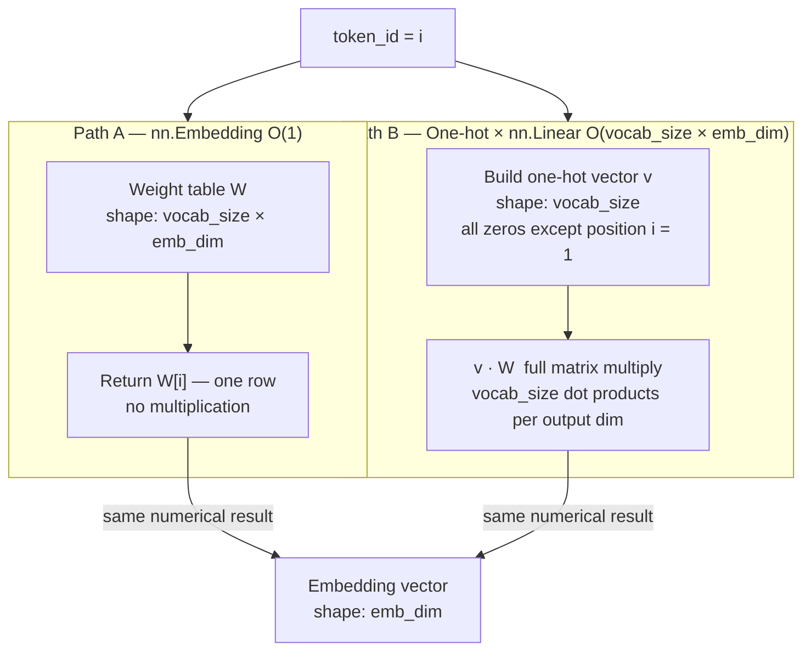
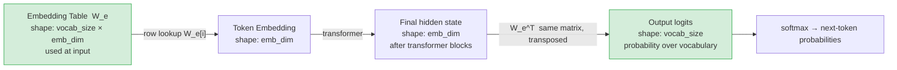

# Chapter 2: Embeddings vs Matrix Multiplication — Are They the Same?
## Reflection Date: March 19, 2026

I used to think `nn.Embedding` and `nn.Linear` were completely different operations. This bonus topic showed me they are mathematically equivalent for the lookup case — but with very different computational profiles.

## The Embedding Lookup

`nn.Embedding(vocab_size, emb_dim)` stores a weight matrix of shape `(vocab_size, emb_dim)`.

When I call it with a token index `i`, it returns `weight[i]` — a single row. This is an **indexed lookup**, not a matrix multiplication. It's O(1) per token regardless of vocabulary size.

## The Matrix Multiplication Version

If I encode the token as a one-hot vector `v` of shape `(vocab_size,)`, then:

$$\text{embedding} = v \cdot W$$

where $W$ is `(vocab_size, emb_dim)`. This produces the same row — but now costs O(vocab_size × emb_dim) FLOPs because it multiplies the full one-hot sparse vector.

## Why This Matters

| Approach | FLOPs | Memory | When used |
|:---------|:------|:-------|:---------|
| `nn.Embedding` (index lookup) | O(1) | Loads 1 row | Training and inference |
| One-hot × linear | O(vocab_size × emb_dim) | Allocates full vocab vector | Never in practice! |

My takeaway: PyTorch's `nn.Embedding` exists *specifically* to avoid the one-hot multiplication. At `vocab_size = 50,257`, the difference is enormous.

## The two paths — side by side

At vocab_size = 50,257 the mat-mul does 50,257 × emb_dim multiply-add operations to produce the same result as a single row copy. This is why `nn.Embedding` exists.

## The Connection to the Output Head

I noticed something interesting when reading `ch04_core.py`: the `output_head` (`nn.Linear(emb_dim, vocab_size, bias=False)`) is the transpose of the embedding table. This is called **weight tying** — the same matrix is used for both input embeddings and output logits, halving the parameter count.

In `GPTModel`, the weight matrices are **not** explicitly tied (they're separate `nn.Embedding` and `nn.Linear` instances), but in original GPT-2 they are. My next step is to verify whether tying them actually matters empirically for small models.

## Weight tying diagram

In original GPT-2, the input embedding table and the final output projection share the same weights (transpose of each other):

Green nodes share the same weight matrix. Tying saves `vocab_size × emb_dim` parameters — for GPT-2 that is ~39M parameters.

## My Confusion (Cleared Up)

I used to confuse "encoding" and "embedding":
- **Encoding** (like one-hot): a rule-based, fixed representation with no learned meaning
- **Embedding**: a *learned* dense vector with semantic content

The matrix-multiplication equivalence is purely a numerical identity. The meaningful difference is that embeddings are **trained to capture similarity**, whereas one-hot encodings are orthogonal by construction.
