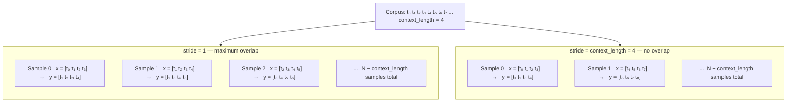
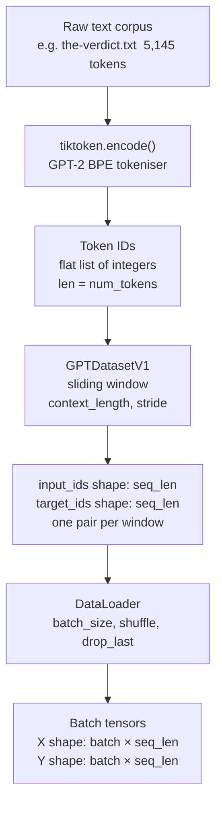

# Chapter 2: Sliding Window Dataloader — How Training Data Is Constructed
## Reflection Date: March 19, 2026

Before I can train a GPT model, I need to understand how the text corpus is converted into (input, target) pairs. This note covers the sliding window dataloader pattern and why it is designed the way it is.

## The Problem: Autoregressive Training

GPT is trained with a **next-token prediction** objective. Given tokens `[t₁, t₂, …, tₙ]`, the model should predict `[t₂, t₃, …, tₙ₊₁]`. So for every sequence of length `context_length`, I need:
- **Input x**: tokens `[0 : context_length]`
- **Target y**: tokens `[1 : context_length + 1]`

The input and target differ by exactly one position — the target is the input shifted one step to the right.

## The Sliding Window Approach

Rather than splitting the corpus into non-overlapping chunks (which wastes data), the dataloader uses a **stride** to slide the context window across the full token sequence:

```
corpus: [t0, t1, t2, t3, t4, t5, t6, t7, ...]
stride=1:
  sample 0:  x=[t0..t3], y=[t1..t4]
  sample 1:  x=[t1..t4], y=[t2..t5]
  sample 2:  x=[t2..t5], y=[t3..t6]
```

With `stride=1`, almost every possible `context_length` window appears as a training sample. With `stride=context_length`, windows are non-overlapping — fewer samples, more unique contexts.

## Sliding window visualised



My key observation: regardless of stride, the target is always the input shifted one step right. That single-token shift is the entire autoregressive training signal.

## My Takeaways

- **stride=1** maximises data utilisation but consecutive batches are nearly identical — this can hurt training if not carefully shuffled.
- **stride=context_length** is standard for large-scale pretraining where the corpus is enormous and unique contexts are plentiful.
- The dataloader I implemented uses PyTorch `Dataset` + `DataLoader` with `shuffle=False` for sequential training (needed to preserve temporal context).

## Connection to the BPE Tokeniser

The dataloader operates on **token IDs**, not raw text. The pipeline is:
1. Raw text → tiktoken `encode()` → list of integer token IDs
2. Token IDs stored as a long tensor
3. Sliding window dataloader builds `(x, y)` pairs from that tensor

My confusion before: I thought "tokens" and "words" were interchangeable. They're not — a single word can map to 2-3 tokens, and punctuation has its own tokens. The window size of 256/512/1024 is in **tokens**, not words.

## Full text-to-batch pipeline



This pipeline runs once at dataset creation — the sliding window pairs are pre-computed and stored, then the DataLoader serves them in random order during training.

## What I Still Need to Practice

I need to build intuition for how batch size, context length, and stride interact to determine the number of training steps. For a corpus of `N` tokens with `stride=context_length`, I get roughly `N / context_length` samples total.
