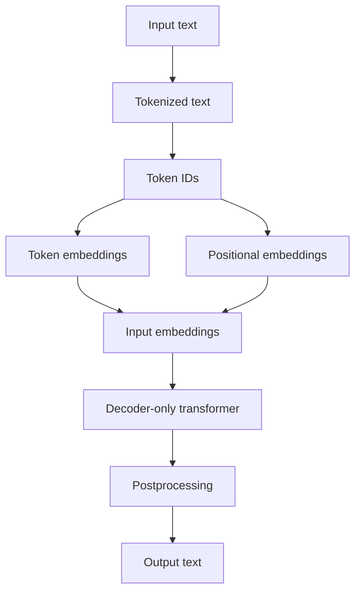

# My Notes: Decoder-Only Transformer Data Flow (Chapter 2)

**Date**: February 3, 2026

I want a simple, end-to-end mental model for how text becomes model inputs and how outputs are produced. The diagram I reviewed shows a decoder-only flow with tokenization, embeddings, and a transformer block in the middle. I’m summarizing it here in my own words.

## What I’m trying to remember

- The model doesn’t see raw text directly.
- It sees **token IDs**, which are numbers created by a tokenizer.
- Each token ID is turned into a **token embedding**.
- **Positional embeddings** are added so the model knows order.
- The sum becomes **input embeddings**.
- These embeddings go into the **decoder-only transformer**.
- The model output is postprocessed back into **output text**.

## My step-by-step picture

1. **Input text** is split into tokens (e.g., “This is an example.”).
2. **Tokenized text** is mapped into **token IDs** (integers).
3. **Token embeddings** convert IDs into vectors.
4. **Positional embeddings** encode order.
5. **Input embeddings** = token embeddings + positional embeddings.
6. **Decoder-only transformer** processes these embeddings.
7. **Postprocessing** converts model outputs into text.

## Mermaid diagram (my simplified flow)

## Why this matters for me

- It explains why embedding layers are central in Chapter 2.
- It reminds me that positional information is explicit, not automatic.
- It helps me connect tokenization (Chapter 2) to the transformer (Chapter 3).

## Reference

- Diagram reviewed in this session (decoder-only transformer flow).
